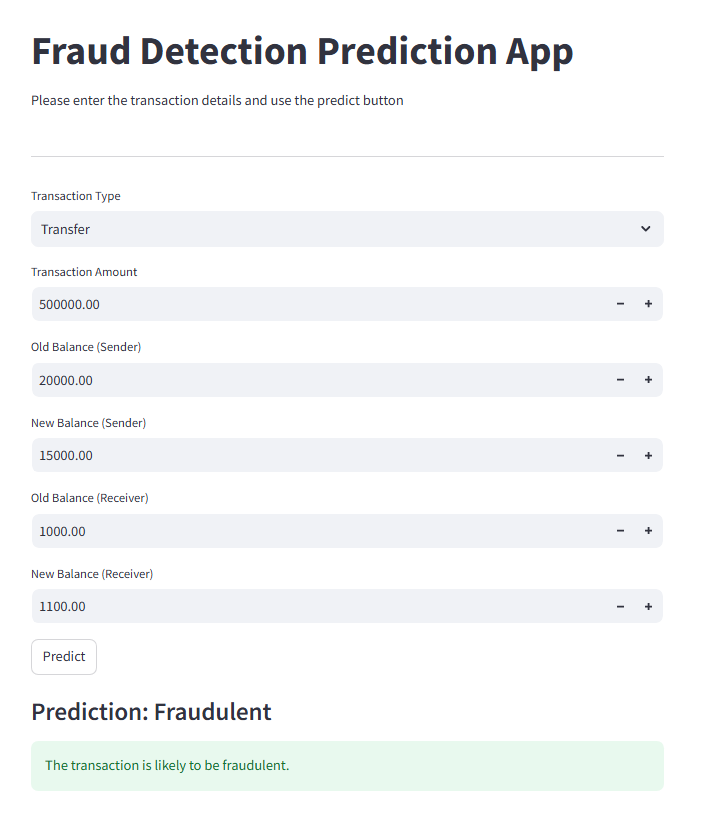

## Hi there, I'm Terrance 👋

## 💫 About Me

🌟 I’m an aspiring **Data Scientist** with a strong foundation in mathematics and a passion for turning complex data into clear, actionable insights.  
🎓 I hold a **B.S. in Mathematics** from *James Madison University* and am pursuing an **M.S. in Data Science** at the *University of Virginia* (Class of 2026).  
💡 My interests span machine learning, data visualization, and applied analytics — exploring how data can drive meaningful decisions and innovation.  
⚡ Outside of data, I enjoy **breakdancing**, where creativity and precision meet — much like in data science!

## 🎓 Education

- **M.S. Data Science**, *University of Virginia* — *Expected August 2026*  
- **B.S. Applied Mathematics**, *James Madison University* — *May 2020*

---

## 💼 Work Experience

### **Graduate Student Researcher · UVA DART Lab**  
📅 *April 2025 – Present*  
- Conduct research in Security Operations Centers (SOCs) and Large Language Models (LLMs) to analyze alert data and improve threat detection strategies.  
- Collaborate with external teams to gather information, conduct interviews, and refine research processes across projects.  
- Identify workflow inefficiencies within SOC operations and implement LLM-based solutions to enhance automation and process efficiency.  

---

### **Data Analyst · Actfore**  
📅 *June 2024 – May 2025*  
- Analyzed and processed sensitive datasets while maintaining compliance with PII, PHI, FERPA, and GDPR regulations.  
- Collaborated cross-functionally to ensure data accuracy and optimize incident response strategies through advanced analytics.  
- Utilized Excel for data reporting and visualization, ensuring reliable record-keeping and streamlined reporting processes.  

---

### **Mathematics & Statistics Learning Assistant · James Madison University**  
📅 *January 2024 – May 2024*  
- Tutored students in statistics, guiding them in data analysis, modeling, and visualization using **IBM SPSS Statistics**.  
- Partnered with professors and peers to improve students’ quantitative reasoning and study techniques.  

# 🧰 Skills & Tools

### 🖥️ Programming & Tools
- **Python:** Pandas, NumPy, SciPy, scikit-learn, Matplotlib, Seaborn  
- **R:** tidyverse, ggplot2, tidymodels  
- **SQL:** Data manipulation, joins, aggregations, query optimization  
- **Java:** Object-oriented programming and algorithmic problem-solving  
- **SAS** & **IBM SPSS Statistics:** Statistical analysis and modeling  

---

### 📊 Data Science & Analytics Techniques
- Data Cleaning & Preprocessing  
- Exploratory Data Analysis (EDA)  
- Statistical Inference & Hypothesis Testing  
- Predictive Modeling (Regression, Classification, Clustering)  
- Time Series Forecasting  
- Bayesian Machine Learning  
- Data Visualization & Storytelling  
- Feature Engineering & Model Evaluation  

---

### ☁️ Certifications & Cloud
- **Microsoft Azure Fundamentals (2022)**  

## Projects

### 💳 Fraud Detection App

[🔗 View on GitHub](https://github.com/tksluangrath/fraud-detection-app/tree/main)

Built a machine learning model and Streamlit app to detect fraudulent transactions from a dataset of **6.3M records**. Applied logistic regression, random forest, and XGBoost to identify fraud patterns, achieving **95% recall** on highly imbalanced data. The deployed app ingests transaction data and predicts fraud in real time.

**Skills:** Classification, Imbalanced Learning, EDA, Feature Engineering, Model Evaluation, App Packaging  
**Tools:** Python, pandas, scikit-learn, Matplotlib, Seaborn, Streamlit, joblib

  

## 📬 Contact

- **Email:** [tksluangrath@gmail.com](mailto:tksluangrath@gmail.com)  
- **LinkedIn:**   
- **GitHub:**   
- **Resume:** 

---

💡 *Feel free to reach out for collaboration, research discussions, or data science opportunities.*

