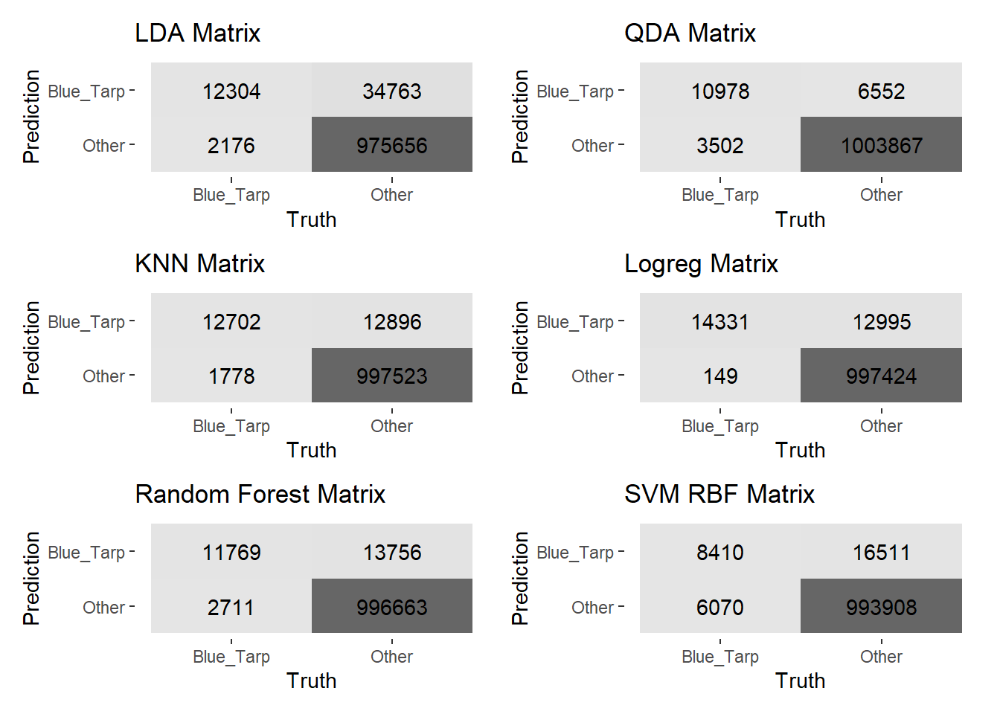
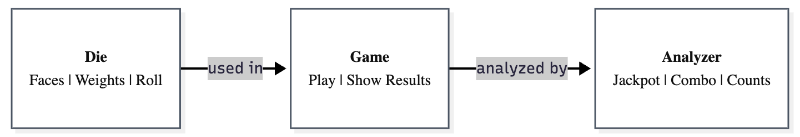

## About Me

I'm a data scientist focused on machine learning, AI automation, and statistical modeling. My work spans cybersecurity, fraud detection, and humanitarian analytics - basically anywhere data can help solve real problems.

Currently getting my M.S. in Data Science at the University of Virginia (4.0 GPA, graduating 2026). I did my undergrad in Applied Mathematics at James Madison University with a minor in Data Analytics.

When I'm not working with data, you'll find me breakdancing. There's something about the mix of creativity and precision that carries over into how I approach finding patterns in datasets.

---

## Education

**University of Virginia** | M.S. Data Science | *Expected August 2026*  
- GPA: 4.0/4.0
- Relevant courses: Bayesian Machine Learning, Statistical Learning, Linear Models, Programming & Computation for Data Science, Practice and Application

**James Madison University** | B.S. Applied Mathematics | Minor: Data Analytics | *May 2024*  
- Relevant courses: Mathematical Modeling & Optimization, Data Analysis & Visualization, SAS Programming & Data Management

---

## Experience

### Graduate Student Researcher | UVA DART Lab  
*March 2025 to Present | Charlottesville, VA*

Working on applying large language models to Security Operations Centers. I'm developing automated alert analysis systems that help uncover threat patterns and improve detection capabilities.

Also collaborating with research teams on human-centric surveys, refining methodologies to improve consistency across different studies. A big part of the work involves identifying bottlenecks in SOC workflows and implementing LLM-based solutions that reduce manual effort for security analysts.

### Junior Data Analyst | ACTFORE  
*June 2024 to May 2025 | Reston, VA*

Worked on AI-led data mining for cyber incident response, helping organizations quickly identify and extract sensitive information from massive datasets during security breaches.

Processed over 1TB of data daily using automated extraction and targeted review systems, maintaining 99%+ accuracy rates confirmed by external audits. The work involved mining for PII, PHI, FERPA, and GDPR data across 120+ data elements to support post-breach compliance and notification requirements.

Collaborated with incident response teams to customize data mining workflows for each engagement, ensuring accurate and timely delivery of notification lists. Managed multiple concurrent data extraction projects while maintaining strict quality control and regulatory compliance standards.

---

## Projects

### Pandas vs Polars: Performance Benchmarking on NYC Taxi Data
[View on GitHub](https://github.com/tksluangrath/pandas-vs-polars) | *Python | December 2025*

Compared Pandas and Polars DataFrame libraries using 50,000 NYC Yellow Taxi trip records to see how they actually perform on real-world data processing tasks.

**What I found:**
- Polars loads CSVs 15× faster due to Rust-based multithreaded parsing (0.0032s vs 0.0463s)
- Both libraries produced identical analytical outputs, confirming correctness
- Polars uses 10% less memory (8.34 MB vs 9.25 MB) thanks to Arrow-native columnar storage
- Performance differences narrow for smaller operations, but would compound significantly with larger datasets

Ran each operation 100 times to ensure statistical reliability. The results helped me understand when to use each library based on dataset size and performance needs.

**Tools:** Python, pandas, Polars, Matplotlib, NYC Open Data API, sodapy

---

### Fraud Detection Machine Learning System
[View on GitHub](https://github.com/tksluangrath/fraud-detection-app/tree/main) | *Python | August – September 2025*

Built an end-to-end ML pipeline analyzing 6.3M+ financial transactions to detect fraudulent activity in real-time.

**Key results:**
- Achieved 95% recall on fraud detection while maintaining 95% overall accuracy despite severe class imbalance (only 0.13% fraud rate)
- Implemented advanced class weighting techniques with logistic regression to handle the imbalanced dataset
- Deployed an interactive Streamlit web app for real-time fraud predictions on new transactions
- Did comprehensive EDA to identify fraud patterns and feature relationships

The biggest challenge was the class imbalance - fraud is rare, which makes it tricky to detect without flagging too many legitimate transactions.

**Tools:** Python, pandas, NumPy, scikit-learn, XGBoost, Matplotlib, Seaborn, Streamlit, joblib

  
   
  <em>Real-time fraud detection interface for instant transaction analysis</em>

---

### Energy Demand Forecasting with XGBoost
[View on GitHub](https://github.com/tksluangrath/energy-forecast-xgboost) | *Python*

Developed a time series forecasting model predicting hourly electricity demand for American Electric Power using gradient boosting.

**What I did:**
- Trained on 14 years of hourly data (2004–2018) - about 121,000 observations
- Achieved RMSE of 1644.39 MW through time-based feature engineering
- Created temporal features (hour, day, month, lag variables) to capture seasonal patterns and demand cycles

The model struggled with extreme weather events, which taught me a lot about XGBoost's limitations for time series without external features like weather data.

**Tools:** Python, pandas, scikit-learn, XGBoost, Matplotlib

---

### Haiti Disaster Relief: Humanitarian Analytics from Aerial Imagery
[Download Report (PDF)](./assets/docs/Haiti_Earthquake_Relief.pdf) | *R | May – August 2025*

Developed machine learning models to identify temporary shelters (blue tarps) from aerial imagery to support post-earthquake disaster relief efforts.

**Key results:**
- Processed pixel-level RGB data to map displaced populations for resource allocation
- Addressed severe class imbalance (≈3% minority class) using SMOTE and threshold optimization
- Compared six classification algorithms (LDA, QDA, KNN, Penalized Logistic Regression, Random Forest, SVM)
- Achieved 99% recall on blue tarp detection with penalized logistic regression

The high recall was critical - missing shelters means missing people who need help. Better to have a few false positives than miss anyone.

**Tools:** R, tidyverse, tidymodels, caret, themis (SMOTE), ggplot2

  
   
  <em>Comparative analysis of six classification models for disaster relief shelter detection</em>

---

### Monte Carlo Simulation Framework (Python Package)
[View on GitHub](https://github.com/tksluangrath/montecarlo) | *Python*

Built a production-ready Python package implementing a Monte Carlo simulation framework with modular, object-oriented design.

**Features:**
- Developed three core classes (Die, Game, Analyzer) for weighted dice simulation and statistical outcome analysis
- Implemented comprehensive error handling, input validation, and unit testing with pytest
- Published as a pip-installable package with full documentation and setuptools integration

This was mostly a software engineering exercise in building clean, testable, distributable code.

**Tools:** Python, NumPy, pandas, pytest, setuptools

  
   
  <em>Object-oriented architecture showing data flow between simulation components</em>

---

## Technical Skills

**Programming:** Python (Pandas, NumPy, SciPy, scikit-learn, Matplotlib, Seaborn), R (tidyverse, caret, ggplot2, tidymodels), SQL (joins, aggregations, subqueries, window functions), SAS, Java

**Machine Learning:** Supervised learning (logistic regression, decision trees, random forests, SVM, KNN), deep learning, Bayesian ML, LLMs, statistical modeling, feature engineering, hyperparameter tuning

**Data Science:** Big data analysis (1TB+ datasets), data wrangling, EDA, statistical inference, hypothesis testing, A/B testing, time series forecasting, imbalanced classification, data visualization

**Tools:** Git/GitHub, Jupyter, Streamlit, Excel (advanced), SPSS, Azure (certified 2022)

**Domains:** Cybersecurity analytics, fraud detection, regulatory compliance (PII, PHI, FERPA, GDPR), humanitarian analytics, energy forecasting

---

## Let's Connect

**📧 Email:** [tksluangrath@gmail.com](mailto:tksluangrath@gmail.com)  
**💼 LinkedIn:**   
**👨‍💻 GitHub:**   
**📄 Resume:** 

---

*Open to data science opportunities, research collaborations, and interesting projects. Feel free to reach out.*
