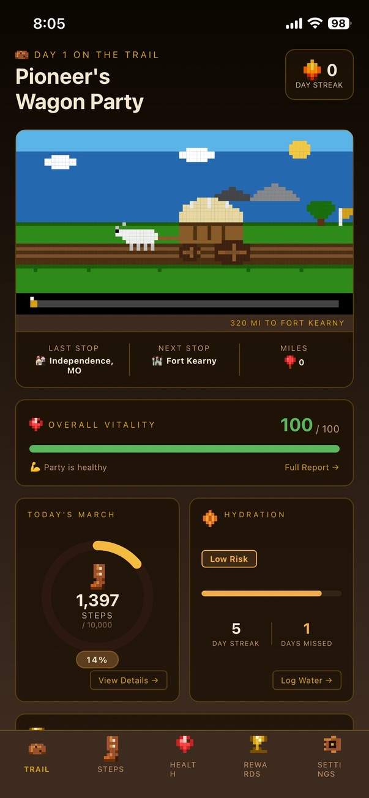

# Terrance Luangrath — Portfolio

## About Me

I'm an M.S. Data Science student at UVA, finishing in 2026. Most days are split between research and side projects. At UVA's DART Lab I work on getting LLMs to triage SOC alerts, the kind of grunt work that eats up an analyst's morning. Outside the lab, my projects span healthcare AI, audio ML, recommenders, fraud detection, and humanitarian analytics.

My background is in Applied Mathematics, so I tend to care about *why* a model works, not just whether it does. I gravitate toward problems where the metric choice matters. Optimizing for recall because missing a case has consequences. Being cautious about what an LLM gets to say in a clinical setting. That kind of thing.

When I'm not doing that, I breakdance. There's more overlap between the two than you'd think.

---

## Table of Contents

- [Education](#education)
- [Experience](#experience)
- [Projects](#projects)
  - [AURA-ED: AI-Powered Emergency Department Risk Analysis](#aura-ed-ai-powered-emergency-department-risk-analysis) — Spring 2026
  - [Frequency-Based Speech Isolation for Keyword Spotting](#frequency-based-speech-isolation-for-keyword-spotting) — Spring 2026
  - [ResumeIQ: AI-Powered Resume Match Scoring](#resumeiq-ai-powered-resume-match-scoring) — Apr 2026
  - [Gold Rush Fitness — HoosHack 2026](#gold-rush-fitness--hooshack-2026) — Mar 2026
  - [Course Recommendation Agent](#course-recommendation-agent) — Jan–Feb 2026
  - [Pandas vs Polars: Performance Benchmarking on NYC Taxi Data](#pandas-vs-polars-performance-benchmarking-on-nyc-taxi-data) — Dec 2025
  - [Investment Portfolio Analytics](#investment-portfolio-analytics) — Nov 2025
  - [Fraud Detection Machine Learning System](#fraud-detection-machine-learning-system) — Aug–Sep 2025
  - [Haiti Disaster Relief: Humanitarian Analytics from Aerial Imagery](#haiti-disaster-relief-humanitarian-analytics-from-aerial-imagery) — May–Aug 2025
  - [Energy Demand Forecasting with XGBoost](#energy-demand-forecasting-with-xgboost) — May 2025
  - [International Students' Mental Health Analysis](#international-students-mental-health-analysis) — May 2025
- [Technical Skills](#technical-skills)
- [Let's Connect](#lets-connect)

---

## Education

**University of Virginia** | M.S. Data Science | *Expected August 2026*
- GPA: 4.0/4.0
- Relevant courses: Bayesian Machine Learning, Statistical Learning, Linear Models, Programming & Computation for Data Science, Practice and Application

**James Madison University** | B.S. Applied Mathematics | Minor: Data Analytics | *May 2024*
- Relevant courses: Mathematical Modeling & Optimization, Data Analysis & Visualization, SAS Programming & Data Management

---

## Experience

### Graduate Student Researcher | UVA DART Lab
*March 2025 to Present | Charlottesville, VA*

My research is on applying LLMs to Security Operations Center workflows. The goal is automated alert analysis: systems that surface the threat patterns analysts would otherwise have to dig out by hand.

I also support other research teams on human-subjects survey work, mostly cleaning up methodology so results stay comparable across studies. A lot of the SOC side is figuring out where analysts get stuck and writing LLM tooling for the worst parts of that.

### Junior Data Analyst | ACTFORE
*June 2024 to May 2025 | Reston, VA*

Did AI-assisted data mining for cyber incident response. When a company got breached, we ran the analysis to figure out what sensitive data the attackers had access to.

Processed over 1 TB daily through automated extraction and targeted review, with 99%+ accuracy verified by external audits. The mining covered PII, PHI, FERPA, and GDPR across 120+ data elements, the kinds of fields regulators expect to see in post-breach notifications.

Each engagement got a custom workflow built with the incident response team, so notification lists came out accurate and on schedule.

---

## Projects

### AURA-ED: AI-Powered Emergency Department Risk Analysis
[View on GitHub](https://github.com/XinnieMai/ed_briefgenerator) · [Tableau Dashboard](https://public.tableau.com/app/profile/terrance.luangrath/viz/AURA-ED/ClinicalRiskDrivers) · *Spring 2026*

Team project for UVA's Healthcare for Data Science course. We built an LLM tool that takes raw ED patient data and produces a structured risk summary. It's the kind of synthesis a clinician usually does in their head while running between rooms.

**The problem:** ED physicians spend roughly 22% of their workweek on indirect tasks like documentation and chart review. Most existing AI tools just transcribe; they don't summarize. We wanted to see how far an LLM could go in that direction.

**What we built:**
- Ingestion pipeline that pulls triage vitals, lab results, comorbidity scores, and demographic data from 118,385 Stanford ED encounters (MC-MED dataset)
- LLM that generates structured risk narratives for high-risk conditions: sepsis, AKI, stroke, PE, ACS, heart failure
- Clinical flagging layer that maps continuous vitals to categorical risk levels and turns ICD codes into readable comorbidity categories
- Tableau dashboard for exploratory risk analysis
- Evaluated on predictive accuracy, hallucination rate, and equity across demographic groups

Preprocessing was the bigger part of the job. Before the LLM could produce anything clinically accurate, we needed outlier filtering, threshold checks against physiological norms, and a translation layer that turned cryptic column headers into actual medical terminology.

**Tools:** Python, pandas, LLM API, Tableau, Stanford MC-MED dataset

---

### Frequency-Based Speech Isolation for Keyword Spotting
[View on GitHub](https://github.com/tksluangrath/ds6050-audio-projects) · *Spring 2026*

Research paper for UVA's Deep Learning course. The question: if you scrub noise out of audio before a model ever sees it, does keyword-spotting accuracy actually improve under noisy conditions?

**Setup:** Trained a CNN and an Audio Spectrogram Transformer (AST) on Google Speech Commands (v0.02), then tested under four noise types from the MUSAN corpus at SNR levels from 20 dB down to -5 dB. Three preprocessing conditions: no filter, bandpass (300–3400 Hz), and spectral gating.

**What we found:**
- The CNN beat the AST in every condition, including clean audio (94.76% vs 90.52% on clean, 81.94% vs 77.40% at -5 dB with the best filter)
- Noise-augmented training was the biggest single factor in robustness, more than any preprocessing choice
- Bandpass filtering gave consistent small gains for both models (+0.38 to +1.62 pp across noise levels)
- Spectral gating helped the CNN slightly but hurt the AST significantly (up to -5.67 pp at -5 dB), because the subtraction artifacts get amplified at the AST's finer spectral resolution

The takeaway: you can't pick a preprocessing strategy without knowing what's downstream. A filter that helps one architecture can hurt another.

**My contributions:** Speech recognition history, dataset section, proposed method, experiments, evaluation metrics, spectrogram conversion and spectral gating implementation.

**Tools:** Python, PyTorch, torchaudio, Google Speech Commands v0.02, MUSAN corpus

---

### ResumeIQ: AI-Powered Resume Match Scoring
[View on GitHub](https://github.com/tksluangrath/ResumeIQ) · *April 2026*

After enough cycles of tweaking my resume for different job postings, I built a tool to do the comparison for me. Paste in a resume and a job description; it returns a match score, flags the skills you're missing, and offers LLM rewrites for the bullet points you'd want to sharpen.

**How it works:**
- spaCy parses both documents and pulls out skill phrases, education, and experience entries
- Sentence-transformer embeddings score semantic overlap between resume content and job requirements, so phrases like "built ML pipelines" still match against "machine learning engineering" without exact keyword overlap
- A skill-gap layer flags requirements with no resume coverage
- An LLM rewrites bullet points to better target the specific posting
- FastAPI backend, TypeScript frontend, CLI for batch use, Dockerized for one-command setup, deployed to Railway

The interesting part was the embedding layer. Keyword matching is brittle. Semantic similarity catches the cases where two resumes describe the same work in totally different words.

**Tools:** Python, FastAPI, spaCy, Sentence Transformers, Alembic, Pytest, Docker Compose, TypeScript, Railway

---

### Gold Rush Fitness — HoosHack 2026
[View on GitHub](https://github.com/RichyKim12/Gold-Rush-Fitness) · [Demo Video](https://www.youtube.com/watch?v=ESyVKxsaHnw) · *March 2026*

Built at HoosHack 2026 (UVA's hackathon) with three teammates over one weekend. Oregon Trail-themed iOS fitness tracker: your steps move a wagon across the trail, and if you don't hit your goals, you die of dysentery.

**What it does:**
- Pulls real-time step data from Apple HealthKit
- Animated wagon scene with trail progress and 7-day step heatmap
- Three-tier daily goal system: Rest Stop (3k steps), Halfway (6k), Full Trail (10k)
- Hydration logging and party health stats
- Badge system with trail milestone unlocks

**Tech:** React Native + Expo frontend, FastAPI backend, PostgreSQL, JWT auth, HealthKit integration via Nitro modules. Required a physical iPhone, since HealthKit doesn't run in simulators.

Hackathons are a different kind of challenge. The scope is intentionally small, the timeline is brutal, and the goal is just something that runs by the end of the weekend. This one did.

**Tools:** React Native, Expo, TypeScript, FastAPI, PostgreSQL, Apple HealthKit

  
   
  <em>Oregon Trail-themed step tracker with HealthKit integration</em>

---

### Course Recommendation Agent
[View on GitHub](https://github.com/tksluangrath/multi-tool-course-agent) · *January – February 2026*

A course recommendation system that pairs classic recommender algorithms with a conversational front-end. Tell it what you want to learn and what you already know; it returns a roadmap with prerequisite chains, skill gaps, and a week-by-week schedule.

Think of it as a knowledgeable friend who's memorized every course on Coursera.

**How it works:**
- Blends content-based filtering (sentence-transformer embeddings + ChromaDB) with collaborative filtering (item-item and user-user similarity)
- LangChain agent backed by Llama 3.1 running locally via Ollama (no API costs)
- Calls the right tools on its own: semantic search, skill gap analysis, prerequisite chains, timeline estimation
- User profiles persist across sessions so you don't re-introduce yourself every time
- Streamlit web app and CLI, deployed via Docker Compose

**Dataset:** 2,759 Coursera courses, 1,754 unique skills, 3,682 prerequisite relationships.

The hard part was making vector search, prerequisite graphs, and tool-calling feel like one coherent system rather than three separate things bolted together.

**Tools:** Python, LangChain, Ollama (Llama 3.1), ChromaDB, sentence-transformers, SQLite, NetworkX, Streamlit, Docker

  
   
  <em>Conversational interface for personalized learning path planning</em>

---

### Pandas vs Polars: Performance Benchmarking on NYC Taxi Data
[View on GitHub](https://github.com/tksluangrath/pandas-vs-polars-nyc-taxi-benchmark) · *December 2025*

Compared Pandas and Polars on 50,000 NYC Yellow Taxi trip records to see how they hold up on typical data processing tasks.

**What I found:**
- Polars loads CSVs 15× faster with Rust-based multithreaded parsing (0.0032s vs 0.0463s)
- Both libraries produced identical analytical outputs
- Polars uses 10% less memory (8.34 MB vs 9.25 MB) thanks to Arrow-native columnar storage
- Performance differences narrow on small operations but compound on larger datasets

Each operation ran 100 times for statistical reliability. The numbers gave me a clearer sense of when it's worth switching libraries and when it doesn't matter.

**Tools:** Python, pandas, Polars, Matplotlib, NYC Open Data API, sodapy

---

### Investment Portfolio Analytics
[View on GitHub](https://github.com/tksluangrath/investment-portfolio-analytics) · *November 2025*

An analytics project that evaluates portfolio performance, attribution, and risk against historical market data. Python pulls and processes; Tableau visualizes.

**What it covers:**
- Portfolio market value and performance tracking over time
- Unrealized gains and losses broken down by position and sector
- Executive-style KPIs as of the latest available market date
- Groundwork laid for volatility and risk analytics in later phases

**How it works:**
- Pulls historical adjusted closing prices from Yahoo Finance via `yfinance`
- Uses simulated portfolio holdings (randomized share counts and cost basis) so the workflow looks real without exposing actual positions
- Outputs clean CSVs (`portfolio_holdings.csv`, `prices_long.csv`) for Tableau consumption
- Interactive Tableau dashboard for exploring performance over time

I built it in phases. Valuation and performance came first, then risk on top. The interesting part was figuring out what a finance team actually needs to see, versus what just looks impressive on a dashboard.

**Tools:** Python, pandas, yfinance, Tableau

---

### Fraud Detection Machine Learning System
[View on GitHub](https://github.com/tksluangrath/fraud-detection-app/tree/main) · *August – September 2025*

An ML pipeline that scans 6.3M+ financial transactions for fraud signals.

**Results:**
- 95% recall on fraud detection, 95% overall accuracy despite a 0.13% fraud rate
- Used class weighting with logistic regression to handle imbalanced data without just oversampling everything
- Streamlit web app for real-time predictions
- Spent serious time on EDA before modeling, mostly to figure out what fraud actually looks like in the data

The hard part wasn't the model. It was the class imbalance. When fraud makes up 0.13% of your data, a model that predicts "not fraud" every time scores 99.87% accurate. Getting to useful recall took some deliberate work.

**Tools:** Python, pandas, NumPy, scikit-learn, XGBoost, Matplotlib, Seaborn, Streamlit, joblib

  
   
  <em>Real-time fraud detection interface</em>

---

### Haiti Disaster Relief: Humanitarian Analytics from Aerial Imagery
[Download Report (PDF)](./assets/docs/Haiti_Earthquake_Relief.pdf) · *May – August 2025*

Trained ML models to spot temporary shelters (blue tarps) in aerial imagery, so aid groups could find displaced populations faster after the earthquake.

**Results:**
- Processed pixel-level RGB data to map displaced populations across affected areas
- Handled severe class imbalance (roughly 3% minority class) with SMOTE and threshold optimization
- Compared six classification algorithms: LDA, QDA, KNN, penalized logistic regression, random forest, and SVM
- 99% recall on blue tarp detection with penalized logistic regression

Recall mattered more than precision here, since a missed shelter means missing people who need help. That shaped every modeling decision.

**Tools:** R, tidyverse, tidymodels, caret, themis (SMOTE), ggplot2

  
   
  <em>Comparison of six classification models for shelter detection</em>

---

### Energy Demand Forecasting with XGBoost
[View on GitHub](https://github.com/tksluangrath/energy-forecast-xgboost) · *May 2025*

A time series model that predicts hourly electricity demand for American Electric Power.

**What I did:**
- Trained on 14 years of hourly data (2004–2018), about 121,000 observations
- RMSE of 1,644.39 MW using time-based feature engineering
- Created temporal features (hour, day of week, month, lag variables) to capture seasonal patterns and demand cycles

It held up fine on typical demand patterns but missed extreme weather events. Which makes sense, since XGBoost doesn't know weather unless you give it weather features. Good reminder that what a model "learns" is just whatever's in the input columns.

**Tools:** Python, pandas, scikit-learn, XGBoost, Matplotlib

---

### International Students' Mental Health Analysis
[View on GitHub](https://github.com/tksluangrath/international-students-mental-health-analysis) · *May 2025*

A SQL analysis of how length of stay affects mental health outcomes for international university students in Japan, using survey data from 268 students collected in 2018.

**What I found:**
- Depression doesn't peak in year 1. It peaks in year 3 (average PHQ-9 score of 9.09, moderate range), then improves slightly in year 4
- Acculturative stress climbs over time instead of dropping, which suggests that long-term decisions around career, visa status, and identity add pressure rather than resolve it
- Social connectedness stays flat across all years, so students aren't building deeper networks even after years abroad
- Nearly half the international sample (95 students) is in year 1, dealing with moderate depression, low social connection, and high stress right from the start

The thing that surprised me most was the year 3 peak. You'd expect the hardest stretch to be the adjustment period, not two years in.

This is cross-sectional data, so individual trajectories are hard to draw conclusions from. Still, the pattern is consistent enough that mental health support for international students probably shouldn't stop after orientation.

**Tools:** PostgreSQL, SQL

---

## Technical Skills

**Languages**

**ML & Modeling**

Logistic regression · Decision trees · Random forests · SVM · KNN · CNN · Bayesian ML · Time series forecasting · Imbalanced classification · Model evaluation and tuning

**AI & LLM Work**

Prompt engineering · Vector search · Sentence transformers · LLM tool-calling and agent design · Clinical NLP

**Libraries & Frameworks**

torchaudio · Matplotlib · Seaborn · tidyverse · ggplot2 · tidymodels · caret

**Data & Engineering**

Vector search and embeddings · Graph algorithms (NetworkX) · ETL pipelines · HealthKit integration

**Domains**

Cybersecurity analytics · Fraud detection · Humanitarian analytics · Healthcare AI · Audio/speech ML · Recommendation systems · Portfolio analytics · Regulatory compliance (PII, PHI, FERPA, GDPR)

---

## Let's Connect

### Author: Terrance Luangrath

📄 [Resume](./assets/docs/Resume.pdf)

---

*Open to data science roles and research collaborations. If anything here looks interesting, send me a note.*
