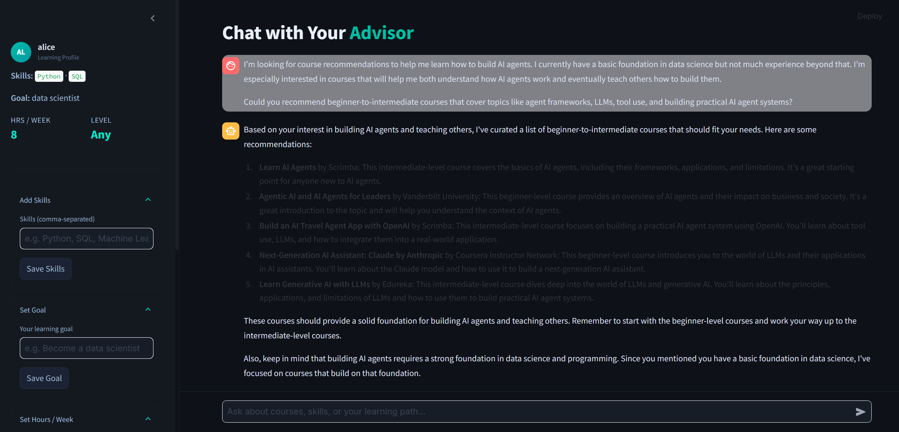
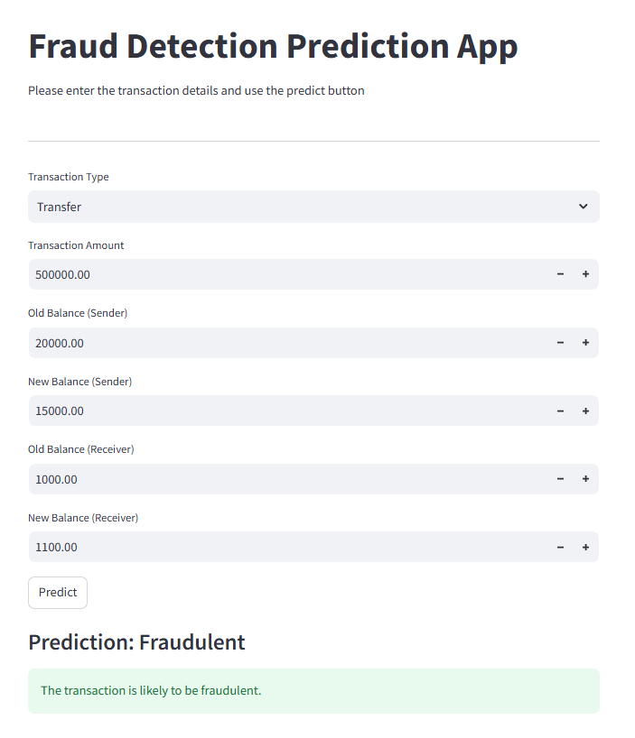
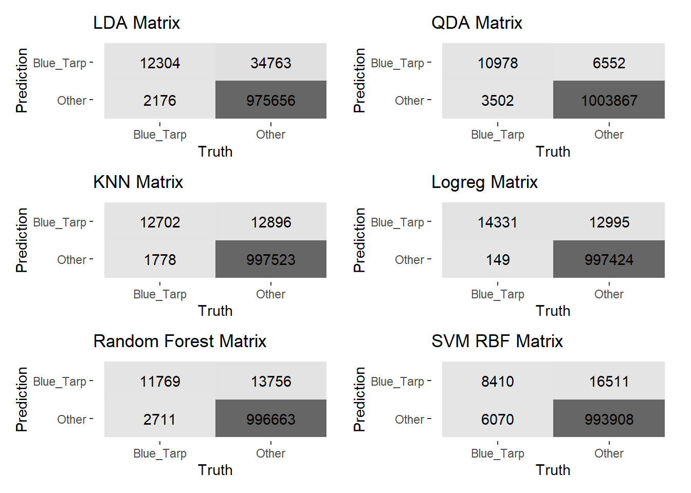

# Terrance Luangrath — Portfolio

## About Me

I'm an M.S. student in Data Science at UVA, finishing up in 2026, and most of my time right now is split between research and building things. At UVA's DART Lab, I work on applying LLMs to Security Operations Centers — reducing the manual burden on analysts by automating alert triage and threat pattern detection. On the project side, I've been building across a pretty wide range of areas: healthcare AI, audio classification, recommendation systems, fraud detection, and humanitarian analytics.

My background is in Applied Mathematics, which means I tend to care a lot about why a model works, not just whether it does. I like projects where the problem is real and the metric choices actually matter — whether that's optimizing recall because missing a case has consequences, or thinking carefully about what an LLM should and shouldn't be trusted to generate in a clinical setting.

When I'm not doing that, I breakdance. There's more overlap between the two than you'd think.

---

## Table of Contents

- [Education](#education)
- [Experience](#experience)
- [Projects](#projects)
  - [AURA-ED: AI-Powered Emergency Department Risk Analysis](#aura-ed-ai-powered-emergency-department-risk-analysis) — Spring 2026
  - [Frequency-Based Speech Isolation for Keyword Spotting](#frequency-based-speech-isolation-for-keyword-spotting) — Spring 2026
  - [Gold Rush Fitness — HoosHack 2026](#gold-rush-fitness--hooshack-2026) — Mar 2026
  - [Course Recommendation Agent](#course-recommendation-agent) — Jan–Feb 2026
  - [Pandas vs Polars: Performance Benchmarking on NYC Taxi Data](#pandas-vs-polars-performance-benchmarking-on-nyc-taxi-data) — Dec 2025
  - [Investment Portfolio Analytics](#investment-portfolio-analytics) — Nov 2025
  - [Fraud Detection Machine Learning System](#fraud-detection-machine-learning-system) — Aug–Sep 2025
  - [Haiti Disaster Relief: Humanitarian Analytics from Aerial Imagery](#haiti-disaster-relief-humanitarian-analytics-from-aerial-imagery) — May–Aug 2025
  - [Energy Demand Forecasting with XGBoost](#energy-demand-forecasting-with-xgboost) — May 2025
  - [International Students' Mental Health Analysis](#international-students-mental-health-analysis) — May 2025
- [Technical Skills](#technical-skills)
- [Let's Connect](#lets-connect)

---

## Education

**University of Virginia** | M.S. Data Science | *Expected August 2026*
- GPA: 4.0/4.0
- Relevant courses: Bayesian Machine Learning, Statistical Learning, Linear Models, Programming & Computation for Data Science, Practice and Application

**James Madison University** | B.S. Applied Mathematics | Minor: Data Analytics | *May 2024*
- Relevant courses: Mathematical Modeling & Optimization, Data Analysis & Visualization, SAS Programming & Data Management

---

## Experience

### Graduate Student Researcher | UVA DART Lab
*March 2025 to Present | Charlottesville, VA*

Working on applying large language models to Security Operations Centers. I'm developing automated alert analysis systems that help uncover threat patterns and improve detection capabilities.

Also collaborating with research teams on human-centric surveys, refining methodologies to improve consistency across different studies. A big part of the work involves identifying bottlenecks in SOC workflows and building LLM-based solutions that reduce manual effort for security analysts.

### Junior Data Analyst | ACTFORE
*June 2024 to May 2025 | Reston, VA*

Worked on AI-led data mining for cyber incident response, helping organizations quickly identify and extract sensitive information from large datasets during security breaches.

Processed over 1TB of data daily using automated extraction and targeted review systems, maintaining 99%+ accuracy rates confirmed by external audits. The work involved mining for PII, PHI, FERPA, and GDPR data across 120+ data elements to support post-breach compliance and notification requirements.

Collaborated with incident response teams to customize data mining workflows for each engagement, ensuring accurate and timely delivery of notification lists.

---

## Projects

### AURA-ED: AI-Powered Emergency Department Risk Analysis
[View on GitHub](https://github.com/XinnieMai/ed_briefgenerator) | [Tableau Dashboard](https://public.tableau.com/app/profile/terrance.luangrath/viz/AURA-ED/ClinicalRiskDrivers) | *Python, LLM | Spring 2026*

Team project for UVA's Healthcare for Data Science course. Built an LLM-powered tool that converts raw ED patient data into structured, executive-level risk narratives — the kind of synthesis a clinician would otherwise have to do manually while juggling a full patient load.

**The problem:** ED physicians spend roughly 22% of their workweek on indirect tasks like documentation and test interpretation. Existing AI tools mostly record data; they don't synthesize it into something actionable. AURA-ED is an attempt to bridge that gap.

**What we built:**
- Ingestion pipeline connecting triage vitals, lab results, comorbidity scores, and demographic data from 118,385 Stanford ED encounters (MC-MED dataset)
- LLM that generates structured risk narratives flagging high-risk conditions: sepsis, AKI, stroke, PE, ACS, heart failure
- Clinical flagging layer mapping continuous vitals to categorical risk levels and translating ICD codes into readable comorbidity categories
- Tableau dashboard for exploratory risk analysis
- Evaluated on predictive accuracy, hallucination rate, and equity across demographic groups

The preprocessing work was more involved than I expected — getting the data into a state where an LLM could produce clinically accurate narratives without hallucinating required careful outlier filtering, physiological threshold validation, and semantic mapping of technical column headers into medical terminology.

**Tools:** Python, pandas, LLM API, Tableau, Stanford MC-MED dataset

---

### Frequency-Based Speech Isolation for Keyword Spotting
[View on GitHub](https://github.com/tksluangrath/ds6050-audio-projects) | *Python, PyTorch | Spring 2026*

Research paper and accompanying experiments for UVA's Deep Learning course. The question we investigated: does explicit frequency-domain noise suppression, applied before a model ever sees the audio, actually improve keyword spotting accuracy under real noise conditions?

**Setup:** Trained a CNN and an Audio Spectrogram Transformer (AST) on Google Speech Commands (v0.02), then tested under four noise types from the MUSAN corpus at SNR levels from 20 dB down to -5 dB. Three preprocessing conditions: no filter, bandpass (300–3400 Hz), and spectral gating.

**What we found:**
- The CNN outperformed the AST in every condition, including clean audio — 94.76% vs 90.52% on clean, 81.94% vs 77.40% at -5 dB with the best filter
- Noise-augmented training was the biggest single factor in robustness — more than any preprocessing choice
- Bandpass filtering gave consistent small gains for both models (+0.38 to +1.62 pp across noise levels)
- Spectral gating helped the CNN slightly but hurt the AST significantly — up to -5.67 pp at -5 dB — because the subtraction artifacts get amplified at the AST's finer spectral resolution

The takeaway: you can't pick a preprocessing strategy without knowing what's downstream. A filter that helps one architecture can hurt another.

**My contributions:** Speech recognition history, dataset section, proposed method, experiments, evaluation metrics, spectrogram conversion and spectral gating implementation.

**Tools:** Python, PyTorch, torchaudio, Google Speech Commands v0.02, MUSAN corpus

---

### Gold Rush Fitness — HoosHack 2026
[View on GitHub](https://github.com/RichyKim12/Gold-Rush-Fitness) | *React Native, Python | March 2026*

Built at HoosHack 2026 (UVA's hackathon) with three teammates over one weekend. Oregon Trail-themed iOS fitness tracker — your steps move a wagon across the trail, and if you don't hit your goals, you die of dysentery.

**What it does:**
- Pulls real-time step data from Apple HealthKit
- Animated wagon scene with trail progress and 7-day step heatmap
- Three-tier daily goal system: Rest Stop (3k steps), Halfway (6k), Full Trail (10k)
- Hydration logging and party health stats
- Badge system with trail milestone unlocks

**Tech:** React Native + Expo frontend, FastAPI backend, PostgreSQL, JWT auth, HealthKit integration via Nitro modules. Required a physical iPhone — HealthKit doesn't run in simulators.

Hackathons are a different kind of challenge. The scope is intentionally smaller, the timeline is brutal, and the goal is something that actually runs by the end of the weekend. This one did.

**Tools:** React Native, Expo, TypeScript, FastAPI, PostgreSQL, Apple HealthKit

---

### Course Recommendation Agent
[View on GitHub](https://github.com/tksluangrath/course-recommnedation-agent) | *Python | January – February 2026*

Built a course recommendation system that combines recommendation algorithms with conversational AI. You describe what you want to learn and what you already know — it builds a structured roadmap with prerequisite chains, skill gap analysis, and week-by-week timelines.

Think of it as a knowledgeable friend who's memorized every course on Coursera.

**How it works:**
- Blends content-based filtering (sentence-transformer embeddings + ChromaDB) with collaborative filtering (item-item and user-user similarity)
- LangChain agent backed by Llama 3.1 running locally via Ollama — no API costs
- Calls the right tools on its own: semantic search, skill gap analysis, prerequisite chains, timeline estimation
- User profiles persist across sessions so you don't re-introduce yourself every time
- Streamlit web app and CLI, deployed via Docker Compose

**Dataset:** 2,759 Coursera courses, 1,754 unique skills, 3,682 prerequisite relationships.

The challenge was making vector search, prerequisite graphs, and LLM tool-calling feel like one coherent system rather than three separate things bolted together.

**Tools:** Python, LangChain, Ollama (Llama 3.1), ChromaDB, sentence-transformers, SQLite, NetworkX, Streamlit, Docker

  
   
  <em>Conversational interface for personalized learning path planning</em>

---

### Pandas vs Polars: Performance Benchmarking on NYC Taxi Data
[View on GitHub](https://github.com/tksluangrath/pandas-vs-polars) | *Python | December 2025*

Compared Pandas and Polars DataFrame libraries using 50,000 NYC Yellow Taxi trip records to see how they hold up on typical data processing tasks.

**What I found:**
- Polars loads CSVs 15× faster with Rust-based multithreaded parsing (0.0032s vs 0.0463s)
- Both libraries produced identical analytical outputs
- Polars uses 10% less memory (8.34 MB vs 9.25 MB) with Arrow-native columnar storage
- Performance differences narrow for smaller operations but compound with larger datasets

Ran each operation 100 times for statistical reliability. The results gave me a clearer sense of when it's actually worth switching libraries and when it doesn't matter.

**Tools:** Python, pandas, Polars, Matplotlib, NYC Open Data API, sodapy

---

### Investment Portfolio Analytics
[View on GitHub](https://github.com/tksluangrath/investment-portfolio-analytics) | *Python, Tableau | November 2025*

Built an end-to-end analytics project that evaluates portfolio performance, attribution, and risk using historical market data. The Python side handles data pulling and processing; Tableau handles the visualization.

**What it covers:**
- Portfolio market value and performance tracking over time
- Unrealized gains and losses broken down by position and sector
- Executive-style KPIs as of the latest available market date
- Groundwork laid for volatility and risk analytics in later phases

**How it works:**
- Pulls historical adjusted closing prices from Yahoo Finance via `yfinance`
- Uses simulated portfolio holdings (randomized share counts and cost basis) to demonstrate real analysis workflows without exposing actual positions
- Outputs clean CSVs (`portfolio_holdings.csv`, `prices_long.csv`) for Tableau consumption
- Interactive Tableau dashboard for exploring performance over time

I built this in phases — starting with valuation and performance reporting, then expanding toward risk. It was a good exercise in thinking about what a finance team actually needs to see versus what looks impressive but doesn't help anyone make decisions.

**Tools:** Python, pandas, yfinance, Tableau

---

### Fraud Detection Machine Learning System
[View on GitHub](https://github.com/tksluangrath/fraud-detection-app/tree/main) | *Python | August – September 2025*

Built an ML pipeline analyzing 6.3M+ financial transactions to detect fraud.

**Results:**
- 95% recall on fraud detection, 95% overall accuracy despite a 0.13% fraud rate
- Used class weighting with logistic regression to handle imbalanced data without just oversampling everything
- Streamlit web app for real-time predictions
- Thorough exploratory analysis to understand what fraud patterns actually looked like before modeling

The hard part wasn't the model — it was the class imbalance. When fraud makes up 0.13% of your data, a model that predicts "not fraud" every time is 99.87% accurate. Getting to useful recall took some deliberate work.

**Tools:** Python, pandas, NumPy, scikit-learn, XGBoost, Matplotlib, Seaborn, Streamlit, joblib

  
   
  <em>Real-time fraud detection interface</em>

---

### Haiti Disaster Relief: Humanitarian Analytics from Aerial Imagery
[Download Report (PDF)](./assets/docs/Haiti_Earthquake_Relief.pdf) | *R | May – August 2025*

Built ML models to identify temporary shelters (blue tarps) from aerial imagery for post-earthquake disaster relief, so aid organizations could locate displaced populations faster.

**Results:**
- Processed pixel-level RGB data to map displaced populations across affected areas
- Handled severe class imbalance (roughly 3% minority class) with SMOTE and threshold optimization
- Compared six classification algorithms: LDA, QDA, KNN, penalized logistic regression, random forest, and SVM
- 99% recall on blue tarp detection with penalized logistic regression

Recall mattered more than precision here — a missed shelter means missing people who need help. That shaped every modeling decision.

**Tools:** R, tidyverse, tidymodels, caret, themis (SMOTE), ggplot2

  
   
  <em>Comparison of six classification models for shelter detection</em>

---

### Energy Demand Forecasting with XGBoost
[View on GitHub](https://github.com/tksluangrath/energy-forecast-xgboost) | *Python | May 2025*

Built a time series model predicting hourly electricity demand for American Electric Power.

**What I did:**
- Trained on 14 years of hourly data (2004–2018), about 121,000 observations
- RMSE of 1,644.39 MW using time-based feature engineering
- Created temporal features (hour, day of week, month, lag variables) to capture seasonal patterns and demand cycles

The model held up well for typical demand patterns but struggled with extreme weather events — which makes sense given XGBoost doesn't know about weather unless you tell it. That limitation was a useful lesson in thinking about what features a model actually needs versus what it's just inferring from time patterns.

**Tools:** Python, pandas, scikit-learn, XGBoost, Matplotlib

---

### International Students' Mental Health Analysis
[View on GitHub](https://github.com/tksluangrath/international-students-mental-health) | *SQL | May 2025*

A SQL-based analysis exploring how length of stay impacts mental health outcomes for international university students in Japan, using survey data from 268 students collected in 2018.

**What I found:**
- Depression doesn't peak in year 1 — it peaks in year 3 (average PHQ-9 score of 9.09, moderate range), then slightly improves in year 4
- Acculturative stress increases over time rather than decreasing, suggesting long-term decisions around career, visa status, and identity add pressure rather than resolve it
- Social connectedness stays flat across all years, meaning students aren't building deeper networks even after years abroad
- Nearly half the international sample (95 students) is in year 1, facing moderate depression, low social connection, and high stress right from the start

The thing that surprised me most was the year 3 peak. You'd expect the hardest stretch to be the adjustment period, not two years in.

This is cross-sectional data, so individual trajectories are harder to draw conclusions from — the same student can't be tracked across years. Still, the patterns are consistent enough to suggest that mental health support for international students shouldn't stop after orientation.

**Tools:** PostgreSQL, SQL

---

## Technical Skills

**Languages**
Python, R, SQL (PostgreSQL, SQLite), SAS, TypeScript, Java

**ML & Modeling**
Logistic regression, decision trees, random forests, SVM, KNN, XGBoost, CNN, Bayesian ML, deep learning, audio classification, time series forecasting, imbalanced classification, model evaluation and tuning

**AI & LLM Work**
LangChain, Ollama, prompt engineering, vector databases (ChromaDB), sentence transformers, LLM tool-calling and agent design, clinical NLP

**Libraries & Frameworks**
pandas, Polars, NumPy, SciPy, scikit-learn, PyTorch, torchaudio, Matplotlib, Seaborn, Streamlit, tidyverse, ggplot2, tidymodels, caret, React Native, FastAPI

**Data & Engineering**
Vector search and embeddings, graph algorithms (NetworkX), ETL pipelines, Docker, Jupyter, Git/GitHub, Tableau, HealthKit integration

**Domains**
Cybersecurity analytics, fraud detection, humanitarian analytics, healthcare AI, audio/speech ML, recommendation systems, portfolio analytics, regulatory compliance (PII, PHI, FERPA, GDPR)

---

## Let's Connect

### Author: Terrance Luangrath

**📧** [tksluangrath@gmail.com](mailto:tksluangrath@gmail.com) | **📄** [Resume](./assets/docs/Resume.pdf)

---

*Open to data science opportunities, research collaborations, and interesting projects. Feel free to reach out.*
