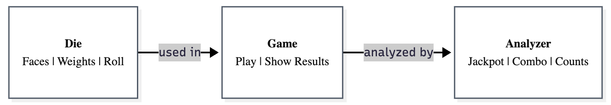

## About Me

I'm a data scientist focused on machine learning, AI automation, and statistical modeling. My work spans cybersecurity, fraud detection, and humanitarian analytics - basically anywhere data can help solve real problems.

Currently getting my M.S. in Data Science at the University of Virginia (4.0 GPA, graduating 2026). I did my undergrad in Applied Mathematics at James Madison University with a minor in Data Analytics.

When I'm not working with data, you'll find me breakdancing. There's something about the mix of creativity and precision that carries over into how I approach finding patterns in datasets.

---

## Education

**University of Virginia** | M.S. Data Science | *Expected August 2026*  
- GPA: 4.0/4.0
- Relevant courses: Bayesian Machine Learning, Statistical Learning, Linear Models, Programming & Computation for Data Science, Practice and Application

**James Madison University** | B.S. Applied Mathematics | Minor: Data Analytics | *May 2024*  
- Relevant courses: Mathematical Modeling & Optimization, Data Analysis & Visualization, SAS Programming & Data Management

---

## Experience

### Graduate Student Researcher | UVA DART Lab  
*March 2025 to Present | Charlottesville, VA*

Working on applying large language models to Security Operations Centers. I'm developing automated alert analysis systems that help uncover threat patterns and improve detection capabilities.

Also collaborating with research teams on human-centric surveys, refining methodologies to improve consistency across different studies. A big part of the work involves identifying bottlenecks in SOC workflows and implementing LLM-based solutions that reduce manual effort for security analysts.

### Junior Data Analyst | ACTFORE  
*June 2024 to May 2025 | Reston, VA*

Worked on AI-led data mining for cyber incident response, helping organizations quickly identify and extract sensitive information from massive datasets during security breaches.

Processed over 1TB of data daily using automated extraction and targeted review systems, maintaining 99%+ accuracy rates confirmed by external audits. The work involved mining for PII, PHI, FERPA, and GDPR data across 120+ data elements to support post-breach compliance and notification requirements.

Collaborated with incident response teams to customize data mining workflows for each engagement, ensuring accurate and timely delivery of notification lists. Managed multiple concurrent data extraction projects while maintaining strict quality control and regulatory compliance standards.

---

## Projects

### Course Recommendation System with AI Learning Path Planner
[View on GitHub](https://github.com/tksluangrath/course-recommendation-agent) | *Python | January – February 2026*

Built a course recommendation system that combines traditional ML with conversational AI to create personalized learning paths. It acts like a learning advisor - you tell it your goals and it builds a structured roadmap.

**What it does:**
- Hybrid recommendation engine (60% content-based, 40% collaborative filtering) with sentence transformers and ChromaDB
- LangChain agent with Llama 3.1 that chats naturally and picks the right tools
- Prerequisite chains across 3,682 relationships with topological sorting for proper course ordering
- Timeline estimation with week-by-week schedules based on available study time
- User profiles that persist across sessions
- Web interface (Streamlit) and CLI chat, deployed via Docker Compose

**Results:**
- Processed 2,759 Coursera courses with 1,754 unique skills
- Built 9 agent tools (search, recommend, skill gap analysis, prerequisites, timeline estimation)
- 10-message conversation memory
- One-command Docker deployment

The challenge was integrating vector search, graph algorithms for prerequisites, and LLM tool-calling into something that feels helpful rather than just algorithmic.

**Tools:** Python, LangChain, Ollama (Llama 3.1), ChromaDB, sentence-transformers, SQLite, NetworkX, Streamlit, Docker

  
   
  <em>Conversational interface for personalized learning path planning</em>

---

### Pandas vs Polars: Performance Benchmarking on NYC Taxi Data
[View on GitHub](https://github.com/tksluangrath/pandas-vs-polars) | *Python | December 2025*

Compared Pandas and Polars DataFrame libraries using 50,000 NYC Yellow Taxi trip records to see how they perform on typical data processing tasks.

**What I found:**
- Polars loads CSVs 15× faster with Rust-based multithreaded parsing (0.0032s vs 0.0463s)
- Both libraries produced identical analytical outputs
- Polars uses 10% less memory (8.34 MB vs 9.25 MB) with Arrow-native columnar storage
- Performance differences narrow for smaller operations but compound with larger datasets

Ran each operation 100 times for statistical reliability.

**Tools:** Python, pandas, Polars, Matplotlib, NYC Open Data API, sodapy

---

### Fraud Detection Machine Learning System
[View on GitHub](https://github.com/tksluangrath/fraud-detection-app/tree/main) | *Python | August – September 2025*

Built an ML pipeline analyzing 6.3M+ financial transactions to detect fraud.

**Results:**
- 95% recall on fraud detection, 95% overall accuracy despite 0.13% fraud rate
- Class weighting with logistic regression to handle imbalanced data
- Streamlit web app for real-time predictions
- Comprehensive EDA to identify fraud patterns

The challenge was the class imbalance - fraud is rare, making it hard to detect without too many false positives.

**Tools:** Python, pandas, NumPy, scikit-learn, XGBoost, Matplotlib, Seaborn, Streamlit, joblib

  
   
  <em>Real-time fraud detection interface</em>

---

### Haiti Disaster Relief: Humanitarian Analytics from Aerial Imagery
[Download Report (PDF)](./assets/docs/Haiti_Earthquake_Relief.pdf) | *R | May – August 2025*

Built ML models to identify temporary shelters (blue tarps) from aerial imagery for post-earthquake disaster relief.

**Results:**
- Processed pixel-level RGB data to map displaced populations
- Handled severe class imbalance (≈3% minority class) with SMOTE and threshold optimization
- Compared six classification algorithms (LDA, QDA, KNN, Penalized Logistic Regression, Random Forest, SVM)
- 99% recall on blue tarp detection with penalized logistic regression

High recall was critical - missing shelters means missing people who need help.

**Tools:** R, tidyverse, tidymodels, caret, themis (SMOTE), ggplot2

  
   
  <em>Comparison of six classification models for shelter detection</em>

---

### Energy Demand Forecasting with XGBoost
[View on GitHub](https://github.com/tksluangrath/energy-forecast-xgboost) | *Python | May 2025*

Built a time series forecasting model predicting hourly electricity demand for American Electric Power.

**What I did:**
- Trained on 14 years of hourly data (2004–2018) - about 121,000 observations
- RMSE of 1644.39 MW through time-based feature engineering
- Created temporal features (hour, day, month, lag variables) for seasonal patterns and demand cycles

The model struggled with extreme weather events, showing XGBoost's limitations for time series without external features like weather data.

**Tools:** Python, pandas, scikit-learn, XGBoost, Matplotlib

---

### Monte Carlo Simulation Framework (Python Package)
[View on GitHub](https://github.com/tksluangrath/montecarlo) | *Python | December 2024*

Built a Python package implementing Monte Carlo simulation with object-oriented design.

**What it includes:**
- Three core classes (Die, Game, Analyzer) for weighted dice simulation and statistical analysis
- Error handling, input validation, and unit testing with pytest
- Pip-installable package with full documentation and setuptools integration

Mostly a software engineering exercise in building clean, testable, distributable code.

**Tools:** Python, NumPy, pandas, pytest, setuptools

  
   
  <em>Object-oriented architecture showing data flow between components</em>

---

## Technical Skills

**Programming & Data Analysis**
- Python: pandas, NumPy, SciPy, scikit-learn, PyTorch, Matplotlib, Seaborn, Streamlit
- R: tidyverse, ggplot2, tidymodels, caret
- SQL: PostgreSQL, SQLite (joins, window functions, query optimization)
- Other: SAS, Java, Git/GitHub

**Machine Learning & AI**
- Supervised learning: logistic regression, decision trees, random forests, SVM, KNN
- Deep learning, Bayesian ML
- LLM integration: LangChain, Ollama, prompt engineering
- Vector databases: ChromaDB, sentence-transformers
- Model evaluation, hyperparameter tuning, feature engineering

**Data Engineering & Tools**
- Vector search and embeddings
- Graph algorithms (NetworkX)
- Data pipelines and ETL
- Docker, Jupyter
- Excel (advanced), SPSS, Azure

**Specialized Domains**
- Recommendation systems (content-based, collaborative filtering, hybrid)
- Time series forecasting
- Imbalanced classification
- Cybersecurity analytics
- Regulatory compliance (PII, PHI, FERPA, GDPR)

---

## Let's Connect

**📧 Email:** [tksluangrath@gmail.com](mailto:tksluangrath@gmail.com)  
**💼 LinkedIn:**   
**👨‍💻 GitHub:**   
**📄 Resume:** 

---

*Open to data science opportunities, research collaborations, and interesting projects. Feel free to reach out.*
